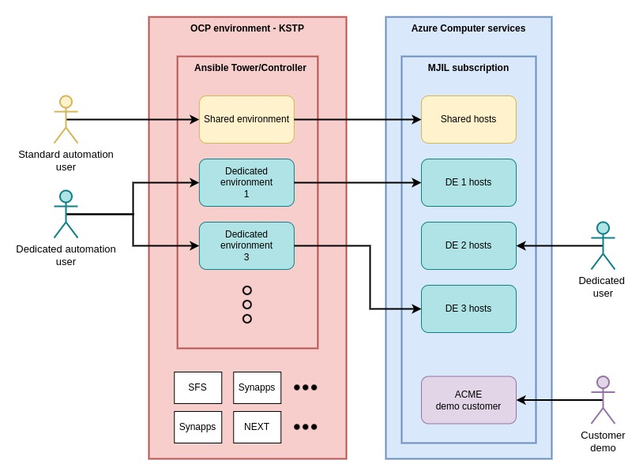

# Introduction to Kyndryl Automation Lab

Brief introduction to KAL and related projects.

## WHY

There are currently hundrets of separated testing environments for dozens of accounts/teams. Many if not majority of them are used infrequently or rarely. This leads to huge waste of resources. On the other hand there are lot of accounts and single developers who wants to develop but they don't have resources to build their own testing environment.

## WHAT

Solution is the testing lab which has shared testing environment which can serve all the accounts with standard needs for development and dedicated environments for the accounts with specific needs that can't be fullfiled by the shared environment. This brings down cost for resources, middleware and infrastructure because they can be shared and reused.

## HOW

We separate usage of Kyndryl Automation Lab into three major use cases.

1. __Shared environment__ - for standard development
2. __Dedicated environments__ - for specialised development
3. __ACME customer__ - demo environment for real customers

### Shared environment

Goal is to serve as many automation developers as possible, giving them prepared and compliant hosts with installed as many middleware as possible that contain also testing data (no real PI/SPI). Basic principles of shared environment are

* Free of charge
* Immidiately ready - no requests needed
* Robust, self repairing - Actions of one user does not affect other users
* Ready subsystems - preinstalled middleware with test data that can users use
* Diversity - provide as many different OSs and subsystems as possible
* No direct access to the hosts. Access only through Ansible automation
* Host VMs exists only during the running tests. When no tests are running then no VMs are running to minimise cost.
* Project is not dependent on the cloud provider. Hosts can be running in Azure, AWS, GCP, ...

### Dedicated environments

Accounts with requirements that are not compatible with Shared environment rules may request creation of test environment dedicated only to them. In such case the dedicated environment may reuse some infrastructure of the Shared environment but the expenses for dedicated assets are cover by the account. Needs of each dedicated environment are handled individualy.

### ACME customer

Demo environment used for meetings with real customers. Limited access only. No testing - handled as a real production customer.

* Contains every product that Kyndryl is offering to the customers.
* Every product must be supported by production teams (patching, bugfixing, etc.)
* Lot of test data (no real customer data)
* Everything built only in one environment. No cross platform solutions.
* Built on Azure cloud with usage of as many tools as service as possible.
* Access only on request.
* No testing allowed. Handled like production.

## FUTURE

[road map](../../roadmap.md)
